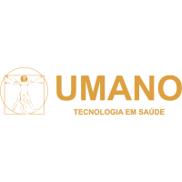
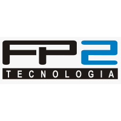

## Sobre

O grupo de usuários de Software Livre Tchelinux, em parceria com a [**Universidade Franciscana**](https://www.ufn.edu.br/site/), tem o prazer de convidar a comunidade para participar do evento que ocorrerá no dia **09 de Novembro de 2019 a partir das 8:30h** no Prédio 14 do Conjunto III da UFN em Santa Maria (Rua Silva Jardim, 1175).

## Inscrições

As inscrições estarão abertas a partir do dia 09 de Outubro, quando a **programação do evento** foi anunciada.

O evento tem **entrada franca**, porém os participantes são encorajados a doar 2kg de alimentos não perecíveis (exceto sal), que são doados a instituições de caridade da região.

Os alimentos são recebidos no momento do credenciamento.

<a href="https://santamaria.tchelinux.org/inscricoes/" style="color:#ff4040"><b><h3>Clique aqui e faça sua inscrição!<h3></b></a>

## Certificados

Serão fornecidos certificados digitais para os participantes do evento, que confirmaram sua presença. Para obtê-los, você deverá utilizar o email fornecido na sua inscrição para o evento.

**Importante:** Não esqueça de confirmar sua presença no credenciamento.

## Programação

| 
 Horário 
 | 
 Sala 201   Desenvolvimento e Metodologias   <small>(40 lugares)</small> 
 | 
 Sala 202   IoT, DevOps e SysAdmin    <small>(40 lugares)</small> 
 | 
 Sala 203   Empreendedorismo e Comunidade   <small>(40 lugares)</small>  
 |
|:--------------------------:|:-----------------------:|:-----------------------:|:-----------------------:|
| **08:30** <td colspan=4>
**Credenciamento**
 |
| **09:00** <td colspan=4>
**Abertura**  Auditório Acústico   Todo o público     Equipe Tchelinux   <small>(120 lugares)</small> 
 |
| **09:30** |  [**O Poder das PWAs**](#O_Poder_das_PWAs)   Principiante   Vinicius Gularte | [**Introdução ao Arduino**](#Introdução_ao_Arduino)   Principiante   Gabriel Fachim | [**JASON: Ambiente Livre para Modelar e Implementar Sistemas Multiagentes no contexto de Inteligência Artificial**](#JASON:_Ambiente_Livre_para_Modelar_e_Implementar_Sistemas_Multiagentes_no_contexto_de_Inteligência_Artificial)   Intermediário   Alexandre Zamberlan |
| **10:15** |  [**Porque Você Deve Aprender Rust**](#Porque_Você_Deve_Aprender_Rust)   Principiante   Julio Biason |[**Desenvolvimento de jogos retrô para consoles 16 bits**](#Desenvolvimento_de_jogos_retrô_para_consoles_16_bits)   Principiante   Fabiano Ferreira |[**Empodere sua comunidade!**](#Empodere_sua_comunidade!)   Avançado   Camile de Paula Silva |
| **11:00** |  [**Python para análise de dados**](#Python_para_análise_de_dados)   Principiante   Andrius Jaques | [**Como o Linux pode facilitar a vida do desenvolvedor iniciante**](#Como_o_Linux_pode_facilitar_a_vida_do_desenvolvedor_iniciante)   Principiante   Diogo Medeiros | [**O Software Livre e o Ensino à Distância**](#O_Software_Livre_e_o_Ensino_à_Distância)   Principiante   Julio Mallmann |
| **11:45** <td colspan=4>
**Intervalo para Almoço**
 |
| **13:15** | [**Fugindo para as Colinas com Python**](#Fugindo_para_as_Colinas_com_Python)   Principiante   Julio Biason | [**Visão Computacional com OpenCV**](#Visão_Computacional_com_OpenCV)   Principiante   Rafael Jeffman | [**Case de Gestão Administrativa e Modularizada com uso do GLPI**](#Case_de_Gestão_Administrativa_e_Modularizada_com_uso_do_GLPI)   Principiante   Ricardo Lazzari da Rosa |
| **14:00** |  [**Desenvolvendo jogos com Python e Pygame**](#Desenvolvendo_jogos_com_Python_e_Pygame)   Principiante   Rafael Jeffman | [**Docker para iniciantes**](#Docker_para_iniciantes)   Principiante   Cristiano Diedrich | [**Você pode jogar no Linux?**](#Você_pode_jogar_no_Linux?)   Principiante   Manuel Vieira |
| **15:45** |  [**Introdução ao Desenvolvimento Móvel com Ionic**](#Introdução_ao_Desenvolvimento_Móvel_com_Ionic)   Principiante   Rafael Jeffman | [**Kubernetes para iniciantes**](#Kubernetes_para_iniciantes)   Principiante   Cristiano Diedrich | [**Coding for Kids: Conheça o Scratch e ScratchJr**](#Coding_for_Kids:_Conheça_o_Scratch_e_ScratchJr)   Principiante   Cassiano Molinari | 
| **15:30** |  [**Riscos e falhas**](#Riscos_e_falhas)   Principiante   Marco Antonio Martins Junior | [**Controlador de Domínio e Compartilhamento de Arquivos com Samba 4**](#Controlador_de_Domínio_e_Compartilhamento_de_Arquivos_com_Samba_4)   Principiante   Alexandre Mendes | [**Porque e Como Participar de Projetos Open Source**](#Porque_e_Como_Participar_de_Projetos_Open_Source)   Principiante   Julio Biason |
| **16:15** <td colspan=4>
**Coffee-Break**
 |
| **16:45** <td colspan=4>
**Encerramento**  Todo o público     Equipe Tchelinux    
 |

## Palestras

### O Poder das PWAs

Abordagem sobre historia das PWAs (Progressive Web Applications), do que são feitas, casos de uso e o futuro do seu desenvolvimento.

### Vinicius Gularte

Vinicius Gularte é Desenvolvedor Front-End na Gestão DS, desde 2014 atuando com desenvolvimento web.

### Porque Você Deve Aprender Rust

Rust (a linguagem, não o jogo) é uma linguagem que produz código em que a memória é protegida. Trazendo muitas das funcionalidades de linguagens funcionais, com abstrações de alto nível e performance semelhante a C, Rust é uma linguagem que você realmente deve aprender.

### Julio Biason

Julio Biason é programador desde os 12 anos e já conheceu várias linguagens, mas nenhuma que fosse tão interessante quanto Rust.

### Python para análise de dados

Conversaremos sobre como o Python vem se destacando e crescendo em meio ao avanço da ciência de dados. Também, quais bibliotecas são utilizadas e os conhecimentos base para avançar no caminho da ciência de dados com Python.

### Andrius Antunes Jaques

Andrius é Analista de Dados na Analisar.net. Programador além do trabalho,  recentemente está retomando projetos do mundo opensource. Também é um entusiasta para projetos ligados a Dados Abertos.

### Fugindo para as Colinas com Python

Uma introdução incomum ao Python. Ao invés de sair explicando cada um dos elementos da linguagem, iremos destrinchar uma simples aplicação que já existe, explicando as peculiaridades da linguagem.

### Julio Biason

[Julio Biason](https://functional.cafe/@juliobiason) participa de projetos open source desde 2000 e é programador Python desde 2004.

### Desenvolvendo jogos com Python e Pygame

Jogar todo mundo joga. Programar, todo mundo pode. Jogar todo mundo treina. Programar, nem tanto. Mas para jogar é necessário que alguém desenvolva suas habilidades de programador. Nesse bate papo, porque ninguém mais tem paciência para palestras, será apresentada uma forma divertida de desenvolver a programação e conhecer a linguagem Python, construindo jogos, utilizando a biblioteca Pygame e ferramentas open source para desenvolver um jogo.

### Rafael Guterres Jeffman

Rafael Jeffman é parte do time de desenvolvimento do FreeIPA (Red Hat), fotógrafo e impressor. Entre os projetos pessoais atuais estão, um conjunto de ferramentas para fotografia profissional open source, uma linguagem para o ensino de design de jogos, uma linguagem para a criação de aperesentações, e um framework que explora o paralelismo massivo para criação de aplicações multimídia. Quando dá tempo e é cobrado, desenvolve os sistemas de backend do Tchelinux, e os piores frontends do mundo.

### Introdução ao Desenvolvimento Móvel com Ionic

Existem duas formas de desenvolver aplicações para dispositivos móveis, utilizando ferramentas nativas, ou utilizando ferramentas híbridas, e cada uma apresenta suas vantagens e desvantagens. Ionic é uma ferramenta híbrida para desenvolvimento de aplicações multi-plataforma, que permite o uso de componentes nativos, mantendo, ainda assim, uma base de código comum. Nessa palestra desenvolveremos uma pequena aplicação para consulta a serviços disponibilizados na web, examinando cada passo do desenvolvimento.

### Rafael Guterres Jeffman

Rafael Jeffman é parte do time de desenvolvimento do FreeIPA (Red Hat), fotógrafo e impressor. Entre os projetos pessoais atuais estão, um conjunto de ferramentas para fotografia profissional open source, uma linguagem para o ensino de design de jogos, uma linguagem para a criação de aperesentações, e um framework que explora o paralelismo massivo para criação de aplicações multimídia. Quando dá tempo e é cobrado, desenvolve os sistemas de backend do Tchelinux, e os piores frontends do mundo.

### Riscos e falhas

Todo projeto tem seus riscos, mas sabia que podemos reduzi-los sem parar de inovar? E quando esse risco acaba virando uma falha, que podemos transformar em oportunidade de aprendizado? É eu sei, parece papo de coach, mas é coisa séria! Nesta palestra falarei sobre duas práticas que já são utilizadas por empresas consideradas "high performers" (de novo esse papo de coach?) para tentar responder essas duas perguntas.

### Marco Antonio Martins Junior

Marco Antonio Martins Junior é Peão as a Service, entusiasta da cultura DevOps, organizador do DevOpsDays Porto Alegre, Docker community leader (Porto Alegre), fuçador convicto, roda praticamente tudo em containers.

### Introdução ao Arduino

Arduino é uma plataforma de hardware e software abertos. Criada com o intuito de agilizar a prototipação de projetos eletrônicos, facilitando o aprendizado de eletrônica e software. O objetivo da palestra é apresentar a plataforma Arduino e o seu ecossistema. Passando pelas etapas necessárias para desenvolvimento de um aplicação.

### Gabriel Azenha Fachim

Gabriel Fachim tem 16 anos e está terminando o curso técnico em Informática.

### Desenvolvimento de jogos retrô para consoles 16 bits

Esta palestra tem por objetivo mostrar os paradigmas, desafios e técnicas de criação de jogos antigos para plataformas de consoles 16 bits, especificamente Mega Drive.

### Fabiano Ferreira

Fabiano Ferreira é Técnico em Processamento de Dados pela Fundação Paula Souza  (São Paulo, SP, 1996), Tecnólogo em Webdesign e Sistemas Digitais pela Universidade Anhembi-Morumbi (São Paulo, SP - 2002).  Atualmente Diretor Executivo da CRIAPOLIS - Inteligência Criativa de Santa Maria, RS.

### Como o Linux pode facilitar a vida do desenvolvedor iniciante

A ideia é dar razões para desenvolvedores usarem um ambiente Linux a partir do day-0 como forma de romper barreiras, expandir e adquirir conhecimentos que serão úteis na sua carreira.

### Diogo Medeiros

Diogo Medeiros foi desenvolvedor web por cerca de 10 anos, usuário há mais de 15 anos e apaixonado por tecnologia desde sempre. Atualmente é CTO no Jetimob, coordenando as áreas de design e programação.

### Visão Computacional com OpenCV

Uma demostração, ao vivo, da criação de uma aplicação de visão computacional utilizando a a biblioteca OpenCV.

### Rafael Guterres Jeffman

Rafael Jeffman é parte do time de desenvolvimento do FreeIPA (Red Hat), fotógrafo e impressor. Entre os projetos pessoais atuais estão, um conjunto de ferramentas para fotografia profissional open source, uma linguagem para o ensino de design de jogos, uma linguagem para a criação de aperesentações, e um framework que explora o paralelismo massivo para criação de aplicações multimídia. Quando dá tempo e é cobrado, desenvolve os sistemas de backend do Tchelinux, e os piores frontends do mundo.

### Docker para iniciantes

O que é um container Linux? Como funciona essa tecnologia? Por onde começo? Entenda nessa apresentação como você pode utilizar a tecnologia de containers para deixar mais eficiente os seus processos de desenvolvimento e entrega de software.

### Cristiano dos Santos Diedrich

Cristiano dos Santos Diedrich é entusiasta Open Source, seu principal foco é ir atrás de ideias novas e torna-las realidade através de soluções simples e eficientes. É organizador do Meetup Docker Porto Alegre, Meetup DevOps/SRE Porto Alegre e DevOpsDays Porto Alegre.

### Kubernetes para iniciantes

Falar em containers é quase falar do passado, pois atualmente esse tipo de tecnologia deixou de ser revolucionário para ser necessário. Obviamente isso gera grandes desafios, principalmente em manter este tipo de ambiente sempre rodando. Para isso existem muitas ferramentas, entre elas o Kubernetes, você sabe o que é? Como ele funciona? Vamos responder juntos essas e outras questões do mais utilizado orquestrador de containers dos dias de hoje.

### Cristiano dos Santos Diedrich

Cristiano dos Santos Diedrich é entusiasta Open Source, seu principal foco é ir atrás de ideias novas e torna-las realidade através de soluções simples e eficientes. É organizador do Meetup Docker Porto Alegre, Meetup DevOps/SRE Porto Alegre e DevOpsDays Porto Alegre.

### Controlador de Domínio e Compartilhamento de Arquivos com Samba 4

Nesta apresentação, iremos mostrar como podemos utilizar o Samba 4 em modo Standalone (compartilhamento de arquivos) e em modo PDC (Controlador de Domínio). Mostraremos também como podemos migrar um Controlador de Domínio de um Windows Server para um Servidor Samba.

### Alexandre Mendes

Alexandre Mendes é Analista de TI no Grupo ÁVATO desde 2010. Técnico em TI pelo Senac Santa Maria, Graduando em Sistemas para Internet pela UniCesumar (EaD). É apaixonado por aviação e aeromodelismo desde criança e usa Linux desde 2010, sendo o Debian seu sistema operacional principal.

### JASON: Ambiente Livre para Modelar e Implementar Sistemas Multiagentes no contexto de Inteligência Artificial

A área de Inteligência Artificial está em pleno destaque. Projetar e implementar sistemas com comportamento inteligente é meta de muitas organizações, seja para descobrir conhecimento, seja para recomendar produtos/serviços, ou até mesmo, para implementar sistemas robóticos automatizados. JASON é um ambiente que é possível modelar e implementar sistemas multiagentes, garantindo autonomia, proatividade e comunicação entre os agentes.

### Alexandre Zamberlan

Alexandre Zamberlan possui graduação em Informática pela Unijuí - RS, especialização em Sistemas de Informação e Telemática pela UFRGS, mestrado em Ciência da Computação pela PUCRS e doutorado em Nanociências pela Universidade Franciscana (antigo Centro Universitário Franciscano) com ênfase em modelagem e simulação de biossistemas e nanomateriais pela abordagem de Sistemas Multiagentes. Além disso, é Professor Assistente IV dos cursos de Ciência da Computação, Jogos Digitais e Sistemas de Informação dessa instituição. Tem experiência na área de Ciência da Computação, com ênfase em Inteligência Artificial, atuando principalmente nos seguintes temas: teoria e modelagem de agentes e sistemas multiagentes; simulação multiagente em ambientes nanoparticulados; engenharia do conhecimento e sistemas de conhecimento. 

### Empodere sua comunidade!

Nesta apresentação veremos: A Jornada do Empreendedor; Quem é a sua comunidade: o retrato de Santa Maria; Os eventos e a conexão; Give First x Give Back.

### Camile de Paula Silva

Camile de Paula Silva é formada em Tecnologia em Processos Gerencias pela UniCesumar e Publicidade e Propaganda pela UFN, foi líder de comunidade do Startup Weekend Santa Maria 2018, participando de 4 eventos na cidade. Apaixonada por comunidades, acredita que as pessoas boas são o caminho para desenvolver Santa Maria. Atualmente proprietária da Planeando Consultoria Digital especializada em Marketing e Branding.

### Porque e Como Participar de Projetos Open Source

No mundo atual, todos usam pelo menos um aplicativo open source. Mas como participar disso? Como ajudar o aplicativo a melhorar? É preciso saber programar para ajudar? Essas e outras perguntas serão respondidas nessa apresentação.

### Julio Biason

Julio Biason participa de projetos open source desde 1990.

### Case de Gestão Administrativa e Modularizada com uso do GLPI

Esta apresentação descreve a implantação da ferramenta GLPI na UNIPAMPA através da modularização estruturada e organizada hierarquicamente para atender a gestão administrativa e institucional de chamados, sendo denominada de GAUCHA. A aplicação foi adequada de acordo com a demanda de serviços e recursos vinculados, e é decorrência de uma gestão focada em níveis de atendimento, automação de requisições, fluxo definido de aprovações, gestão e projetos e da possibilidade de integração com serviços externos (fornecedores). Os resultados são discriminados com o feedback dos usuários, considerando a pesquisa de satisfação e a gestão de relatórios com uso de dados gráficos, como no caso das métricas do sistema.

### Ricardo Lazzari da Rosa

Ricardo Lazzari da Rosa possui graduação em Ciência da Computação (Comparação entre as Metodologias de Alinhamento de DNA) pelo Centro Universitário Franciscano (2008). Possui especialização em Engenharia de Sistemas (Altiris Deployment Solution: Solução para Automação e Manutenção de Redes de Computadores) pela Escola Superior Aberta do Brasil (2011). Atualmente é Analista de Tecnologia da Informação da Universidade Federal do Pampa (UNIPAMPA), onde atuou como coordenador (2017-2018) da Coordenação de Redes, Infraestrutura e Suporte (CORIS) da Diretoria de Tecnologia da Informação e Comunicação (DTIC). Tem experiência na área de Ciência da Computação, com ênfase em Ciência da Computação.

### Você pode jogar no Linux?

Essa é uma das perguntas mais frequentes de pessoas que estão pensando em mudar para o Linux. Afinal, os jogos no Linux costumam ser considerados uma possibilidade distante. De fato, algumas pessoas até se perguntam se conseguem ouvir música ou assistir filmes no Linux. Considerando isso, a pergunta sobre jogos nativos do Linux parece genuína. Vou tentar responder à maioria das perguntas sobre jogos em Linux que um iniciante em Linux possa ter. Por exemplo, se é possível jogar no Linux, se sim, quais são os jogos disponíveis no Linux, de onde você pode baixar jogos do Linux ou como obter mais informações sobre jogos no Linux.

### Manuel de Jesús Pérez Vieira

Manuel de Jesús Pérez Vieira é Técnico em Processamento de Dados, ex-acadêmico em Publicidade e Propaganda, ex-acadêmcia em Ciência da Compuatação, acadêmico em Gestão da Tecnologia da Informação, ex Professor Técnico em Informática, atualmente trabalhando com desenvolvimento de Impressoras 3D.

### Coding for Kids: Conheça o Scratch e ScratchJr

As habilidades necessárias para programação, como a lógica de programação e trabalhar com blocos de código, podem ser trabalhadas de forma lúdica com crianças de idades variadas com o Scratch e ScratchJr. Conheça estas ferramentas e divirta-se junto com elas enquanto aprendem.

### Cassiano Molinari Gomes

Cassiano Molinari Gomes é Técnico Químico, técnico em informática e técnico em automação industrial. Acadêmico de Pedagogia e de Licenciatura em Computação. Entusiasta de Linux e da cultura Open Source, tradutor voluntário na distro Deepin para português do Brasil. Acredita que o compartilhamento do conhecimento e cultura é a melhor forma de contribuir para a melhorar a vida das pessoas e cumprir o papel social da ciência.

### O Software Livre e o Ensino à Distância

Relatar e incentivar a utilização do Software livre no EAD.

### Julio Roberto dos Santos Mallmann

Julio Mallmann é Professor da Rede Pública a 16 anos, Pós-Graduado em Pedagogia, Assistente à Docência no Polo UAB Cruz Alta, Coordenador Pedagógico em EAD

## Local

> **Universidade Franciscana - Conjunto III**
> Rua Silva Jardim, 1175 - Bairro Nossa Senhora do Rosário
> Santa Maria, RS

  <iframe src="https://www.google.com/maps/embed?pb=!1m14!1m8!1m3!1d8244.287608607932!2d-53.820758441782175!3d-29.682198291787028!3m2!1i1024!2i768!4f13.1!3m3!1m2!1s0x0%3A0xe61043465ea9807b!2sUFN!5e0!3m2!1spt-BR!2sbr!4v1563138307957!5m2!1spt-BR!2sbr" width="600" height="480" frameborder="0" style="border:0" allowfullscreen></iframe>

## Apoio

### Institucional

### Divulgação

