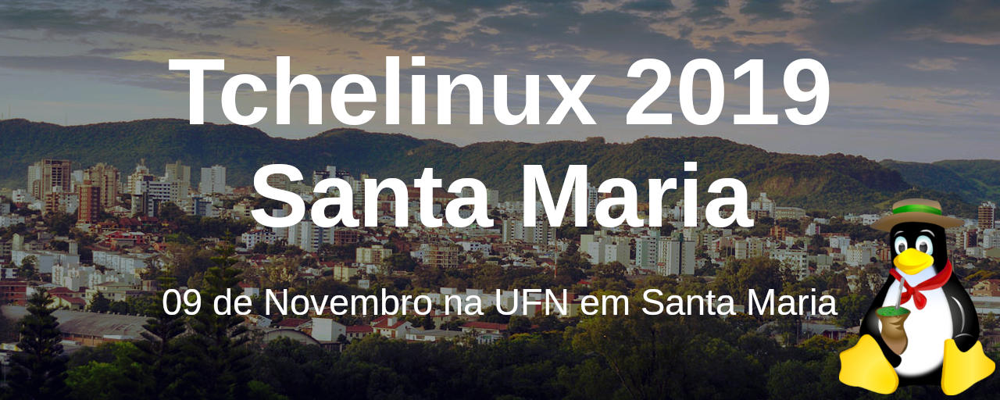
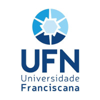
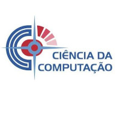
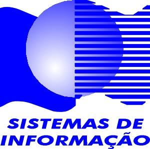

## Sobre

O grupo de usuários de Software Livre Tchelinux, em parceria com a [**Universidade Franciscana**](https://www.ufn.edu.br/site/), tem o prazer de convidar a comunidade para participar do evento que ocorrerá no dia **09 de Novembro de 2019 a partir das 8:30h** na UFN em Santa Maria.

## Chamada de Trabalhos

A Chamada de Trabalhos está aberta e o **prazo para submissão** de propostas de palestra é **14 de Setembro de 2019**. Os trabalhos escolhidos serão anúnciados no dia 26 de Agosto de 2019.

[**Clique aqui e submeta sua palestra agora mesmo!**](https://santamaria.tchelinux.org/cfp/)

## Inscrições

As inscrições estarão abertas a partir do dia 16 de Setembro, quando a **programação do evento** for anunciada.

O evento tem **entrada franca**, porém os participantes são encorajados a doar 2kg de alimentos não perecíveis (exceto sal), que são doados a instituições de caridade da região.

Os alimentos são recebidos no momento do credenciamento.

## Certificados

Serão fornecidos certificados digitais para os participantes do evento, que confirmaram sua presença. Para obtê-los, você deverá utilizar o email fornecido na sua inscrição para o evento.

**Importante:** Não esqueça de confirmar sua presença no credenciamento.

## Local

> **Universidade Franciscana - Conjunto III**
> Rua Silva Jardim, 1175 - Bairro Nossa Senhora do Rosário
> Santa Maria, RS

  <iframe src="https://www.google.com/maps/embed?pb=!1m14!1m8!1m3!1d8244.287608607932!2d-53.820758441782175!3d-29.682198291787028!3m2!1i1024!2i768!4f13.1!3m3!1m2!1s0x0%3A0xe61043465ea9807b!2sUFN!5e0!3m2!1spt-BR!2sbr!4v1563138307957!5m2!1spt-BR!2sbr" width="600" height="480" frameborder="0" style="border:0" allowfullscreen></iframe>

## Apoio

### Institucional

### Divulgação

